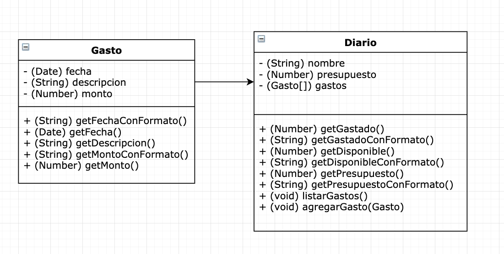

# Tarea Conceptos Básicos: Diario de gastos

En este ejemplo se ponen en práctica los siguientes conceptos básicos de la programación orientada a objetos:

- Clase
- Objeto
- Atributo
- Método
- Método Constructor
- Encapsulación

## Instrucciones

Se requiere desarrollar una aplicación para la  administración de gastos diarios con base a un presupuesto. La aplicación deberá implementar las clases que se muestra en el siguiente diagrama.

## Descripción de clases, métodos y atributos

A continuación se describen algunas de las clases, métodos y atributos del diagrama

### Clase Gasto

#### Atributos
- (Date) fecha Fecha en la que se realizó el gasto
- (String) Descripción o motivo del gasto
- (Number) Monto que corresponde al gasto realizado

#### Métodos
- (String) getFechaConFormato() Regresa un String con la fecha en la que se realizó el gasto con el siguiente formato 11/Mayo/2020
- (String) getGastadoConFormato() Regresa la suma total de todos los gastos realizados como un String con el siguiente formato $1,234.56
- (String) getDisponibleConFormato() Regresa el total de presupuesto disponible como un String con el siguiente formato $1,234.56
- (String) getPresupuestoConFormato() Regresa el presupuesto total como un String con el siguiente formato $1,234.56
- (void) listarGastos() Imprime en consola un listado de gastos con el siguiente formato (no es necesario que sea una tabla, puede ser un listado simple)
Nun | Fecha | Descripción | Monto
--- | --- | --- | --- 
1 | 11/Mayo/2020 | Taxi | $50.00
2 | 11/Mayo/2020 | Comida| $150.00
3 | 12/Mayo/2020 | Hospedaje | $500.00
  |  | Total gastado | $700.00
  | | Total disponible | $1,300.00
  

